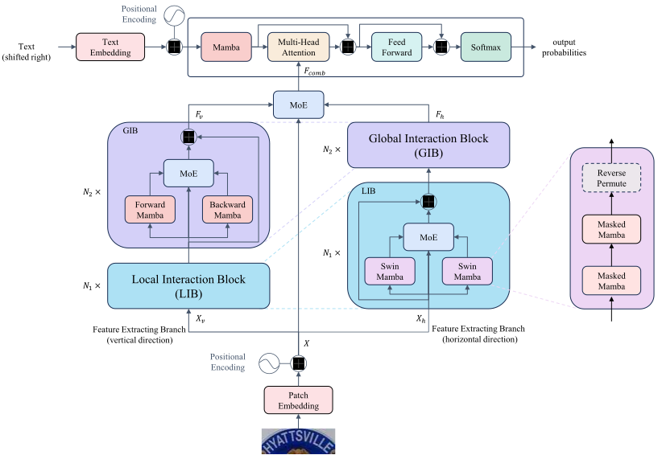

<div align="center">
<h1> MambaSTR: Scene Text Recognition <br> with Masked State Space Model </h1>
</div>

## Abstract

Lightweight and efficient model design is a significant trend in the field of deep learning. For scene text recognition (STR) task, most transformer-based methods have achieved remarkable accuracy. However, transformers have been criticized for their quadratic growth in computational overhead with se-quence length. Mamba, as a well-designed solution for sequence modeling, has not been explored for STR. In this paper, we design a Swin-Mamba which is a highly parallelized solution based on Mamba for local window in-teraction and cross window connection. Based on it, we propose a novel mamba-based model for STR, called MambaSTR, striving to achieve compa-rable accuracy while maintaining fewer parameters and lower inference overhead. MambaSTR consists of a Swin-Mamba-based dual-branch encoder and a simple mamba decoder. Each encoder branch performs a series of lo-cal and global interaction on image tokens according to different scanning di-rections. Mixture-of-Experts strategy is adopted to dynamically fuse the in-formation from different directions. Extensive experiments demonstrate that MambaSTR achieves SOTA accuracy on multiple datasets.

## Overview



## Installation

Below are quick steps for installation.

```shell
conda create -n mambastr python=3.10 -y
conda activate mambastr
pip install torch==2.1.2 torchvision==0.16.2 --index-url https://download.pytorch.org/whl/cu118
pip install packaging
pip install requirements/causal-conv1d-1p1p3/
pip install -e requirements/mamba-1p1p1/
pip install -r requirements/requirements.txt
```

## Training

Training with single GPU:

```shell
python train.py --model_name mambastr
```

Training with multiple GPUs:

```shell
torchrun --nproc_per_node=auto train.py --model_name mambastr
```

## Evaluation

```shell
python test.py --model_name mambastr --checkpoint_path <path_to_weight_file>
```

## Acknowledgement

This project is based on Mamba ([paper](https://arxiv.org/abs/2312.00752), [code](https://github.com/state-spaces/mamba)), Vision Mamba ([paper](https://icml.cc/virtual/2024/poster/33768), [code](https://github.com/hustvl/Vim)), Causal-Conv1d ([code](https://github.com/Dao-AILab/causal-conv1d)). Thanks for their wonderful works.

## Citation

If you find MambaSTR is useful in your research or applications, please consider cite:

```bibtex
 @inproceedings{mambastr,
  title={MambaSTR: Scene Text Recognition with Masked State Space Model},
  author={Zhou, Bo and Zhu, Anna and Yang, JunJie},
  booktitle={International Conference on Intelligent Computing},
  year={2025}
}
```
